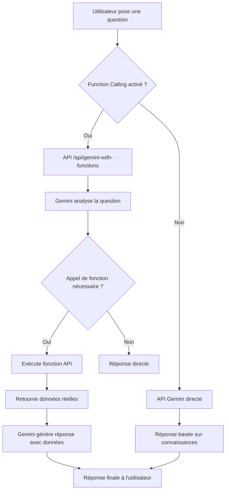

# 🤖 Gemini Function Calling - Guide Complet

## 🎯 **Vue d'ensemble**

Emma peut maintenant accéder aux **données financières en temps réel** grâce au **Function Calling** de Gemini 2.5 Flash. Cette fonctionnalité permet à Emma de :

- ✅ **Obtenir les prix d'actions actuels**
- ✅ **Récupérer les actualités financières récentes**
- ✅ **Accéder aux données de marché détaillées**
- ✅ **Fournir des analyses basées sur des données réelles**

## 🔧 **Architecture Technique**

### **API Route : `/api/gemini-with-functions`**
- **Méthode :** POST
- **Entrée :** `{ message: string, temperature: number }`
- **Sortie :** `{ response: string, temperature: number, timestamp: string, source: string }`

### **Fonctions Disponibles :**

#### **1. `get_stock_price(symbol)`**
```javascript
// Exemple d'utilisation
"Quel est le prix de Tesla ?" 
→ Gemini appelle automatiquement get_stock_price("TSLA")
→ Retourne: { symbol: "TSLA", price: 245.67, change: 2.34, ... }
```

#### **2. `get_financial_news(query, limit)`**
```javascript
// Exemple d'utilisation
"Actualités sur Apple"
→ Gemini appelle automatiquement get_financial_news("AAPL", 5)
→ Retourne: { articles: [{ title: "...", url: "...", ... }] }
```

#### **3. `get_market_data(symbol)`**
```javascript
// Exemple d'utilisation
"Données complètes sur Microsoft"
→ Gemini appelle automatiquement get_market_data("MSFT")
→ Retourne: { name: "Microsoft", marketCap: 3000000000000, ... }
```

## 🎛️ **Interface Utilisateur**

### **Contrôle Function Calling :**
- **Bouton :** 🌡️ Température
- **Toggle :** "Function Calling (Données Temps Réel)"
- **Description :** "Emma peut accéder aux données financières actuelles via nos APIs"

### **États :**
- **Activé (défaut) :** Emma utilise les APIs pour des données réelles
- **Désactivé :** Emma utilise uniquement ses connaissances d'entraînement

## 🚀 **Exemples d'Utilisation**

### **Questions qui déclenchent des appels de fonction :**

#### **Prix d'actions :**
- "Quel est le prix de Tesla ?"
- "Combien vaut Apple aujourd'hui ?"
- "Prix actuel de Microsoft"

#### **Actualités financières :**
- "Actualités sur NVIDIA"
- "Nouvelles récentes sur les actions canadiennes"
- "Que dit-on sur Amazon ?"

#### **Données de marché :**
- "Capitalisation de Google"
- "PE ratio de Meta"
- "Dividendes de Johnson & Johnson"

#### **Analyses complexes :**
- "Compare Apple et Microsoft"
- "Analyse Tesla vs Rivian"
- "Perspectives du secteur technologique"

## 🔄 **Flux de Fonctionnement**



## 🧪 **Tests et Validation**

### **Script de test :** `test-gemini-functions.js`
```bash
node test-gemini-functions.js
```

### **Questions de test :**
1. "Quel est le prix actuel de Tesla (TSLA) ?"
2. "Donne-moi les dernières actualités sur Apple (AAPL)"
3. "Compare Microsoft (MSFT) et Google (GOOGL)"
4. "Analyse les données de marché de NVIDIA (NVDA)"
5. "Actualités récentes sur les actions canadiennes"

## ⚙️ **Configuration**

### **Variables d'environnement requises :**
```env
GEMINI_API_KEY=your_gemini_api_key
FINNHUB_API_KEY=your_finnhub_api_key (optionnel)
ALPHA_VANTAGE_API_KEY=your_alpha_vantage_api_key (optionnel)
```

### **APIs utilisées :**
- **Yahoo Finance :** Gratuit, pas de clé requise
- **Finnhub :** Pour données avancées
- **Alpha Vantage :** Pour profils d'entreprise
- **NewsAPI :** Pour actualités financières

## 🎯 **Avantages**

### **Pour l'utilisateur :**
- ✅ **Données actuelles** - Plus de données obsolètes
- ✅ **Analyses précises** - Basées sur des faits réels
- ✅ **Réponses contextuelles** - Adaptées au marché actuel
- ✅ **Contrôle total** - Peut activer/désactiver à volonté

### **Pour Emma :**
- ✅ **Expertise renforcée** - Accès aux données en temps réel
- ✅ **Crédibilité accrue** - Analyses basées sur des faits
- ✅ **Flexibilité** - Peut s'adapter aux besoins
- ✅ **Performance** - Réponses plus pertinentes

## 🔍 **Débogage**

### **Logs de console :**
```javascript
🔧 Utilisation de Gemini avec Function Calling
🔧 Gemini appelle: get_stock_price { symbol: "TSLA" }
✅ Résultat: { symbol: "TSLA", price: 245.67, ... }
✅ Réponse avec Function Calling reçue
```

### **Problèmes courants :**
1. **Erreur 404 :** API route non déployée
2. **Erreur 500 :** Clé API manquante
3. **Pas de données :** APIs externes indisponibles
4. **Réponse lente :** Limites de taux des APIs

## 🚀 **Déploiement**

### **Vercel :**
- ✅ **Automatique** - Déploiement via GitHub
- ✅ **Serverless** - Pas de serveur à gérer
- ✅ **Scalable** - Gère la charge automatiquement

### **URLs de test :**
- **Production :** `https://gob-jsla.vercel.app/api/gemini-with-functions`
- **Local :** `http://localhost:3000/api/gemini-with-functions`

## 📈 **Métriques de Performance**

### **Temps de réponse typiques :**
- **Sans function calling :** 1-2 secondes
- **Avec function calling :** 3-5 secondes
- **Analyses complexes :** 5-10 secondes

### **Limites :**
- **Vercel Hobby :** 10 secondes max par requête
- **APIs externes :** Limites de taux variables
- **Gemini :** 60 requêtes/minute

## 🎉 **Conclusion**

Le **Function Calling** transforme Emma d'un simple chatbot en un **assistant financier intelligent** capable d'accéder aux données en temps réel. Cette fonctionnalité révolutionne l'expérience utilisateur en fournissant des analyses basées sur des faits actuels plutôt que sur des connaissances d'entraînement potentiellement obsolètes.

**Emma est maintenant prête pour des analyses financières professionnelles !** 🚀
